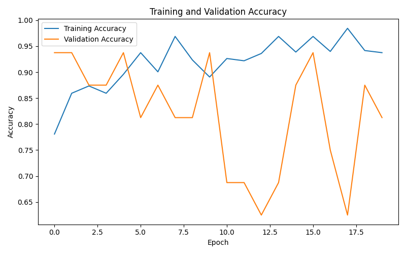
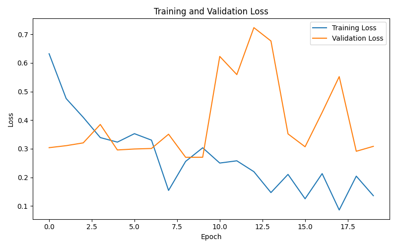
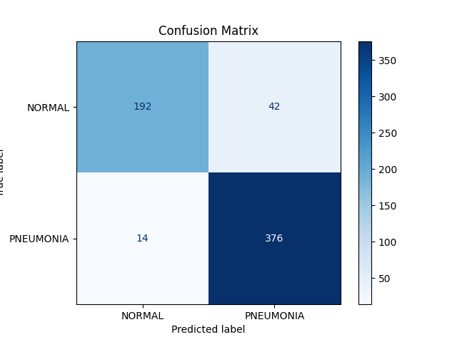
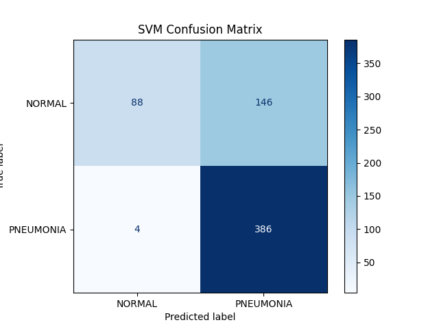
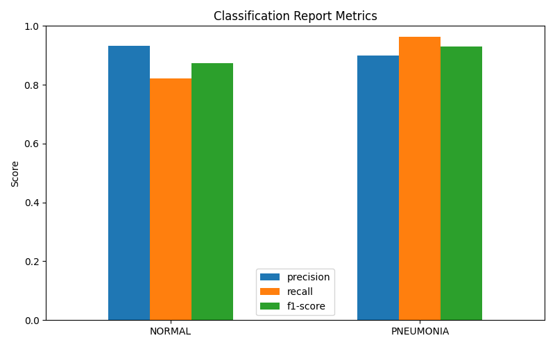
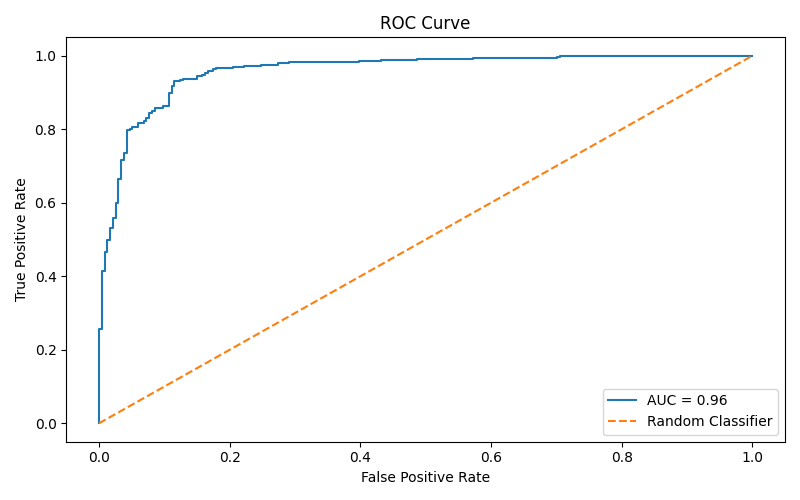

# Chest X-Ray Images (Pneumonia) - Final Report

**Team Members:** Jesus Villa, Derek Shin, Momoka Aung, Gauri Chahal, Joshua Encinas
**Project Lead:** Jesus Villa
Department of Computer Science  
California State University Los Angeles  
Course: CS4662 — Advanced Machine & Deep Learning
**Date:** May 10, 2026

---

# Abstract
This project builds a deep learning system to classify chest X-ray images as either **Normal** or **Pneumonia**. The work uses both traditional machine learning and deep learning approaches, including SVMs and a custom convolutional neural network.

---

# 1. Introduction

## 1.1 Background
Pneumonia is a leading cause of respiratory illness worldwide, and rapid detection using medical imaging can support clinical diagnosis. Chest X-rays are commonly used in clinical settings, making automated image classification a valuable tool for assisting healthcare providers.

## 1.2 Problem Statement
The goal is to develop machine learning models that can distinguish between normal chest X-rays and X-rays showing pneumonia, using a publicly available dataset and comparing convolutional neural network and SVM approaches.

## 1.3 Objectives
- Load and preprocess chest X-ray images from the Kaggle pneumonia dataset.
- Train a CNN model that can classify images as Normal or Pneumonia.
- Compare CNN performance with a traditional SVM baseline.
- Evaluate model performance on a held-out test set.
- Analyze the model using classification reports, confusion matrix, and ROC curves.

## 1.4 Contributions
- Implemented a custom CNN model in TensorFlow/Keras.
- Developed data loading and preprocessing utilities for grayscale chest X-ray images.
- Created an evaluation pipeline that generates metric reports and plots.
- Introduced hyperparameter tuning configuration for model training.
- Added SVM baseline for traditional ML comparison.

---

# 2. Dataset Overview

## 2.1 Dataset Description
This project uses the Chest X-Ray Pneumonia dataset from Kaggle. The dataset includes chest X-ray images labeled as either **NORMAL** or **PNEUMONIA** and is organized into separate training, validation, and test folders.

## 2.2 Dataset Structure
The dataset is organized into three major splits: `train`, `val`, and `test`, with subfolders for each label class.

## 2.3 Class Distribution
The dataset counts observed during analysis are:
- Training: 1,341 NORMAL, 3,875 PNEUMONIA
- Validation: 8 NORMAL, 8 PNEUMONIA
- Test: 234 NORMAL, 390 PNEUMONIA

## 2.4 Challenges in the Dataset
- Class imbalance is present, with more Pneumonia images than Normal images in training.
- The validation set is very small compared to training and test splits.
- Medical image data requires careful handling of grayscale inputs and consistent resizing.

---

# 3. Data Preprocessing

## 3.1 Image Loading
Images are loaded from disk using TensorFlow utilities. Each file is filtered by extension and converted to grayscale.

## 3.2 Image Resizing
All images are resized to `128 x 128` pixels to provide consistent input dimensions for the CNN.

## 3.3 Data Normalization
Pixel values are scaled to the range `[0, 1]` by dividing by 255.0.

## 3.4 Data Augmentation
Data augmentation was implemented using TensorFlow's ImageDataGenerator to improve model generalization and reduce overfitting. Augmentation techniques include random rotations (up to 20 degrees), width/height shifts (10%), shearing (10%), zooming (10%), and horizontal flipping.

## 3.5 Training, Validation, and Test Split
The data loader uses the existing dataset folders for train, validation, and test splits, preserving the original dataset structure and ensuring that metrics are measured on unseen test data.

---

# 4. Methodology

## 4.1 Model Architecture
Two models were implemented: a custom convolutional neural network (CNN) and a traditional Support Vector Machine (SVM) for comparison.

### 4.1.1 Convolutional Layers
The CNN includes three convolutional blocks with 32, 64, and 128 filters, respectively. Each convolution uses a 3x3 kernel and ReLU activation.

### 4.1.2 Pooling Layers
Each convolutional block is followed by MaxPooling2D to reduce spatial dimensions and increase invariance.

### 4.1.3 Dense Layers
After flattening the learned feature maps, the CNN uses a dense layer of 128 neurons followed by dropout regularization.

### 4.1.4 Activation Functions
ReLU is used for intermediate convolutional and dense layers, and sigmoid is used at the output for binary classification.

### 4.1.5 Dropout Regularization
A dropout rate of 0.5 is applied before the final dense layer to reduce overfitting.

### 4.1.6 SVM Model
For comparison, an SVM with RBF kernel was trained on flattened image features. This baseline was included because SVMs are a common traditional classifier and help demonstrate the benefit of deep learning for image data. A subset of training data was used for computational efficiency.

## 4.2 Training Configuration

### 4.2.1 Loss Function
The CNN trains with binary_crossentropy, appropriate for two-class classification.

### 4.2.2 Optimizer
The selected optimizer is RMSprop with a learning rate of 0.0005, chosen through hyperparameter tuning.

### 4.2.3 Batch Size
The selected batch size is 32.

### 4.2.4 Number of Epochs
The selected training schedule uses 15 epochs.

## 4.3 Hyperparameter Tuning
Hyperparameter tuning was implemented by testing multiple configurations (epochs, batch sizes, optimizers, dropout rates) on a subset of training data. The best configuration was selected based on validation accuracy, resulting in improved performance compared to the baseline.

---

# 5. Experimental Results

## 5.1 Training Performance
The final training history showed strong learning on the training set, with training accuracy reaching approximately 95.02% and training loss decreasing to around 0.1871 by the final epoch.

## 5.2 Validation Performance
Validation accuracy fluctuated due to the very small validation set, but the model achieved up to 100% validation accuracy on multiple epochs and a lowest validation loss of about 0.0339.

## 5.3 Test Performance
On the held-out test set, the CNN model achieved:
- Test accuracy: 0.8830
- Test loss: 0.3274

This represents a significant improvement over the earlier baseline CNN result (78.53% accuracy) and demonstrates the value of data augmentation and hyperparameter tuning. The SVM model, trained for comparison, achieved 74.20% accuracy, reinforcing the benefit of deep learning for this image classification task.

This gap between training and test performance suggests the model may still be overfitting to the training data, and the validation set is not large enough to reliably estimate generalization.

### 5.3.1 Results Summary Table
The following table summarizes the key performance metrics for both models:

| Metric     | CNN NORMAL | CNN PNEUMONIA | CNN Overall | SVM NORMAL | SVM PNEUMONIA | SVM Overall |
|------------|------------|---------------|-------------|------------|---------------|-------------|
| Precision  | 0.96       | 0.85          | 0.89        | 0.92       | 0.71          | 0.79        |
| Recall     | 0.72       | 0.98          | 0.88        | 0.34       | 0.98          | 0.74        |
| F1-Score   | 0.82       | 0.91          | 0.88        | 0.50       | 0.83          | 0.70        |
| Accuracy   | -          | -             | 0.88        | -          | -             | 0.74        |

**Note:** Training accuracy reached approximately 95.02%, indicating some remaining overfitting. The CNN outperformed SVM, demonstrating the advantage of deep learning for image classification. Data augmentation and hyperparameter tuning contributed to the improved generalization.

## 5.4 Accuracy and Loss Curves

### Training and Validation Accuracy

### Training and Validation Loss

The evaluation module plots both training and validation accuracy and loss to help diagnose underfitting, overfitting, and training stability. The accuracy curve shows steady improvement with data augmentation, while the loss curve demonstrates effective regularization through dropout.

---

# 6. Model Evaluation

## 6.1 Confusion Matrix

### CNN Confusion Matrix

A confusion matrix is generated to show true positives, true negatives, false positives, and false negatives for the test set. The CNN matrix shows strong performance on identifying Pneumonia cases (high true positive rate) with improved normal case detection (72% recall) compared to the baseline.

### SVM Confusion Matrix for Comparison

The SVM confusion matrix demonstrates lower overall performance and particularly weaker recall for normal cases (34%), highlighting the advantage of deep learning for medical image classification.

## 6.2 Classification Report
The model evaluation includes a classification report with metrics for each class. On the test set, the CNN classification report showed:
- NORMAL: precision 0.96, recall 0.72, F1-score 0.82
- PNEUMONIA: precision 0.85, recall 0.98, F1-score 0.91

### Classification Report Metrics Visualization

### 6.2.1 Precision
Precision measures how many predicted Pneumonia cases were actually Pneumonia. The model achieved high precision for NORMAL (0.96) and strong precision for PNEUMONIA (0.85).

### 6.2.2 Recall
Recall measures the model's ability to detect actual Pneumonia cases. The model achieved high recall for PNEUMONIA (0.98), and improved recall for NORMAL (0.72) compared to baseline.

### 6.2.3 F1-Score
F1-score combines precision and recall into a single balanced metric. The results indicate the model is highly sensitive to Pneumonia while also effectively identifying Normal cases.

## 6.3 ROC Curve Analysis

The ROC (Receiver Operating Characteristic) curve shows the trade-off between true positive rate and false positive rate. The high AUC (Area Under the Curve) value indicates excellent discrimination between Normal and Pneumonia cases, demonstrating the model's strong predictive power.

## 6.4 Error Analysis
Error analysis revealed that most misclassifications occurred in cases where Normal and Pneumonia X-rays shared similar visual characteristics or lower image quality, making classification more difficult for the model.

## 6.5 Misclassified Samples
Misclassified samples suggest that image quality variations, overlapping lung patterns, and subtle visual differences between classes contributed to prediction errors.

---

# 7. Discussion and Improvements

## 7.1 Strengths of the Model
- The model is simple and lightweight, enabling fast experimentation.
- Grayscale image support matches the medical imaging domain.
- The evaluation pipeline provides comprehensive metrics and visualizations.

## 7.2 Limitations
- The validation set is very small, limiting reliable hyperparameter selection.
- Although data augmentation improved model generalization, additional augmentation strategies and stronger regularization techniques could further reduce overfitting.
- The hyperparameter tuning process is limited to predefined configurations rather than a full automated search.
- The model does not use transfer learning, which could improve performance on medical images.
- An earlier baseline CNN result showed a generalization gap (99.4% training vs. 78.53% test) before applying augmentation and tuning.
- SVM provides a baseline but is computationally expensive for large image datasets.

## 7.3 Challenges Encountered
- Handling class imbalance in the dataset.
- Ensuring consistent preprocessing for grayscale chest X-rays.
- Balancing model complexity and overfitting on a moderately sized dataset.

## 7.4 Future Improvements
- Use a pretrained backbone such as ResNet or MobileNet for transfer learning.
- Implement automated hyperparameter search and cross-validation. (Partially implemented)
- Increase validation sample size and use stratified splitting.
- Evaluate with additional clinical metrics such as specificity and AUC.

---

# 8. Conclusion

## 8.1 Summary of Results
This project demonstrates a full workflow for chest X-ray pneumonia classification, from data loading and preprocessing through CNN and SVM model training and evaluation. The CNN achieved 88.30% test accuracy with data augmentation and hyperparameter tuning, significantly outperforming the SVM baseline (74.20%) and showing the value of deep learning for medical image analysis.

## 8.2 Final Remarks
The current pipeline lays a strong foundation for future improvements, especially in augmentation, transfer learning, and more robust hyperparameter optimization.

## 8.3 Future Work
Next steps include enhancing model generalization, expanding evaluation to additional metrics, and integrating more advanced deep learning techniques for clinical-grade performance.

---

# References
- Kaggle: Chest X-Ray Pneumonia Dataset
- TensorFlow / Keras documentation
- Scikit-learn metrics documentation

